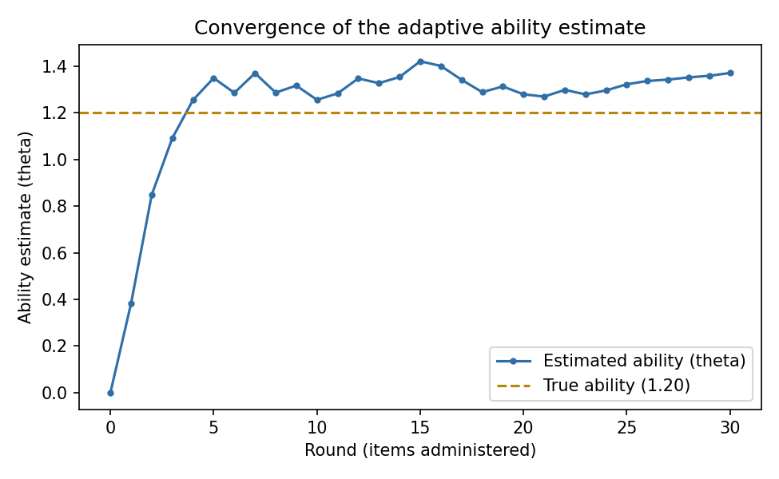
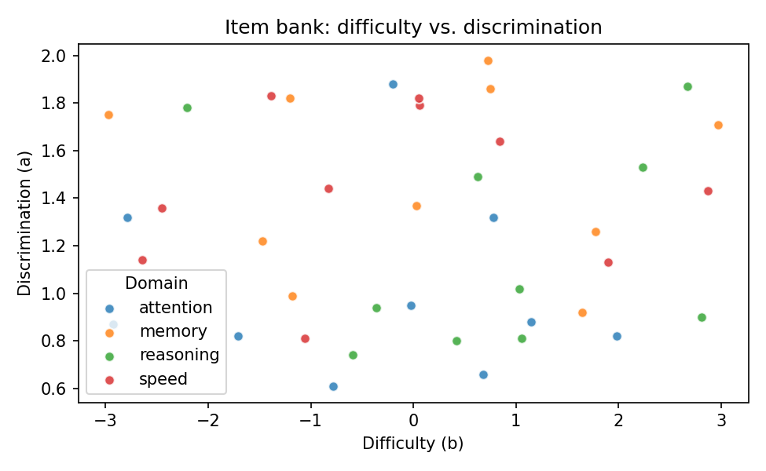

# CogniPlay Adaptive Engine

[](https://github.com/MrZhorik09/cogniplay-adaptive-engine/actions/workflows/ci.yml)
[](LICENSE)
[](pyproject.toml)

An **Item-Response-Theory (IRT) based adaptive difficulty engine** for
*CogniPlay* — a cognitive-training platform application with gamification.

This repository is the practical part of Assignment 3 ("Software
Development and Integration"), and it implements the computational core
that Assignment 2's architecture evaluation report described as the
**"Adaptive Algorithm Service"**: the component responsible for estimating
a user's cognitive ability in near real time and selecting exercises at the
difficulty level that is most informative for that estimate. The two
assignments are therefore part of the same project: Assignment 2 justified
*why* this component should exist and how it fits the overall architecture;
this repository is *how* it actually works.

## What it does

1. **Models exercises with a 2-parameter logistic (2PL) IRT model**
   (`adaptive_engine.irt`) — each item has a difficulty (`b`) and
   discrimination (`a`); the probability a user answers it correctly is a
   logistic function of the gap between their ability and the item's
   difficulty.
2. **Selects the next exercise by maximum Fisher information**
   (`adaptive_engine.selector`) — the classic computerized-adaptive-testing
   (CAT) strategy: always administer the item that is most informative
   about the user's *current* ability estimate.
3. **Updates the ability estimate online, after every answer**
   (`irt.update_ability`) — a lightweight, Elo-style gradient step so the
   estimate adapts within a single session without needing to re-fit the
   full response history.
4. **Awards gamification XP** (`adaptive_engine.gamification`) — harder,
   well-targeted items and longer answer streaks are worth more, tying the
   adaptive engine's output directly to CogniPlay's Gamification Engine.
5. **Simulates full sessions** (`adaptive_engine.simulate`) for a synthetic
   user with a known "true" ability, so the algorithm's convergence can be
   verified the same way Assignment 2 recommended (pilot-style validation,
   risk R1) before it ever meets a real user.

## Example output

Convergence of the online ability estimate toward a synthetic user's true
ability (`theta = 1.2`) over a 30-item adaptive session:



The 40-item sample item bank used for this simulation, spanning four
cognitive domains:



## Installation

```bash
git clone https://github.com/MrZhorik09/cogniplay-adaptive-engine.git
cd cogniplay-adaptive-engine
python -m venv .venv && source .venv/bin/activate   # on Windows: .venv\Scripts\activate
pip install -e ".[dev]"
```

## Usage

### As a command-line tool

```bash
# Simulate a 30-item adaptive session for a synthetic user and save a convergence plot
python -m adaptive_engine.cli simulate --items data/sample_item_bank.csv \
    --true-theta 1.2 --rounds 30 --seed 7 --plot convergence.png

# Visualize the item bank itself (difficulty vs. discrimination, by domain)
python -m adaptive_engine.cli item-bank-plot --items data/sample_item_bank.csv \
    --output item_bank.png
```

`simulate` prints a JSON summary, e.g.:

```json
{
  "rounds": 30,
  "true_theta": 1.2,
  "final_theta_estimate": 1.37,
  "final_error": 0.17,
  "total_xp": 362,
  "best_streak": 7
}
```

### As a Python library

```python
from adaptive_engine.item_bank import load_item_bank
from adaptive_engine.simulate import simulate_session

items = load_item_bank("data/sample_item_bank.csv")
result = simulate_session(items, true_theta=1.2, rounds=30, seed=7)

print(result.final_theta, result.final_error, result.total_xp)
```

## Project structure

```
cogniplay-adaptive-engine/
├── .github/
│   ├── workflows/ci.yml          # GitHub Actions: lint + test + build, on every push/PR
│   └── ISSUE_TEMPLATE/           # bug report / feature request templates
├── src/adaptive_engine/
│   ├── irt.py                    # 2PL model: P(correct), Fisher information, ability update
│   ├── item_bank.py               # Item dataclass + CSV loading
│   ├── selector.py                # next-item selection (maximum information)
│   ├── gamification.py            # XP / streak scoring
│   ├── simulate.py                # end-to-end adaptive-session simulator
│   ├── plotting.py                # convergence / item-bank plots (headless matplotlib)
│   └── cli.py                     # command-line interface
├── tests/                         # pytest test suite (34 tests, 99% coverage)
├── data/sample_item_bank.csv      # synthetic 40-item bank across 4 cognitive domains
├── docs/                          # example plots used in this README
├── pyproject.toml                 # package metadata + flake8 config
├── requirements.txt / requirements-dev.txt
├── LICENSE                        # MIT
└── README.md
```

## Development

```bash
pip install -e ".[dev]"

# Lint
flake8 src tests

# Run tests with coverage
pytest --cov=adaptive_engine --cov-report=term-missing
```

Both steps run automatically in CI (`.github/workflows/ci.yml`) on every push and pull
request to `main`, across Python 3.9, 3.10 and 3.11, followed by a package build check.

## Why these technologies

- **Python** - the de-facto standard for scientific/numerical computing, and a direct
  match for the "Adaptive Algorithm Service (IRT/ML)" named in the CogniPlay architecture.
- **pandas** - loading and validating the CSV item bank.
- **matplotlib** (`Agg` backend) - generating convergence/diagnostic plots identically on
  a laptop and in a headless CI runner.
- **pytest** - concise test syntax, fixtures, and `pytest-cov` for coverage reporting;
  used here to validate the IRT math itself (e.g., that Fisher information peaks at the
  item's own difficulty), not just that the code runs.
- **flake8** - fast, low-friction style/lint checking, configured via `.flake8`.
- **GitHub Actions** - CI configuration lives next to the code, needs no external service
  setup, and is free for public repositories.

## Continuous Integration / Continuous Delivery

See [`.github/workflows/ci.yml`](.github/workflows/ci.yml). On every push and pull
request to `main`, the pipeline:

1. Installs the package and dev dependencies on Python 3.9 / 3.10 / 3.11.
2. Lints the code with `flake8`.
3. Runs the full `pytest` suite (34 tests) with coverage reporting.
4. Builds the distributable package (`python -m build`) as a final sanity check.

Pipeline runs: **https://github.com/MrZhorik09/cogniplay-adaptive-engine/actions**

## Relationship to Assignment 2

| Assignment 2 (architecture report) | This repository |
|---|---|
| "Adaptive Algorithm Service (IRT/ML)" box in the architecture diagram | `adaptive_engine.irt` + `adaptive_engine.selector` |
| "Gamification Engine" module | `adaptive_engine.gamification` |
| Risk R1: "Adaptive algorithm fails to converge or personalizes poorly" | `adaptive_engine.simulate` - lets convergence be checked against a known synthetic ability *before* real users are involved |
| Recommendation: "pilot-cohort validation" | The `simulate` CLI command *is* a lightweight, repeatable stand-in for that pilot validation |

## Conclusion / notes on this assignment

Implementing the actual adaptive algorithm (rather than a generic, unrelated
data-processing demo) made the exercise noticeably more useful: writing tests for the IRT
math surfaced real design questions that a toy example would not have, in particular:

- The **online ability-update step size** needed tuning (`base_rate` in `irt.py`): too
  large, and the estimate oscillates wildly between items instead of converging smoothly;
  too small, and it barely moves. The final value was chosen empirically by simulating
  sessions and inspecting the convergence plot.
- **Maximum-information item selection** can get "stuck" repeatedly picking
  similar items once the estimate stabilizes near one item's difficulty; the item bank
  needs enough spread in `b` across each domain for this not to matter in practice.
- As with the first version of this repository, `matplotlib.use("Agg")` must be called
  before `pyplot` is imported for plots to render in a headless CI runner.

## License

Released under the [MIT License](LICENSE).
