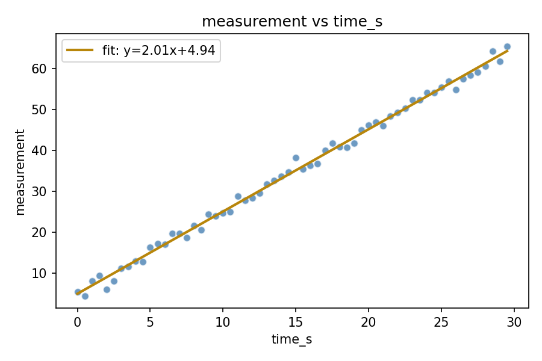

# sciviz

[](https://github.com/MrZhorik09/sciviz-toolkit/actions/workflows/ci.yml)
[](LICENSE)
[](pyproject.toml)

A small, dependency-light Python toolkit for **loading, statistically summarizing, and
visualizing experimental / scientific data** exported as CSV — the kind of quick
plot-and-describe workflow that comes up constantly when processing lab measurements,
simulation output, or survey data.

Built as the practical part of *Assignment 3 — Software Development and Integration*
(version control, CI/CD, and scientific-software best practices).

## Features

- **`sciviz.stats`** — descriptive statistics (mean, std, median, min/max, 95% confidence
  interval) for a numeric column, robust to missing/non-numeric values.
- **`sciviz.plotting`** — publication-style plots with a headless (`Agg`) matplotlib
  backend, so they also run in CI without a display:
  - histogram
  - scatter plot with an optional linear trendline
  - line plot with vertical error bars
- **`sciviz.cli`** — a small command-line interface wrapping both of the above.

## Example output

Scatter plot with a fitted trendline, generated from `data/sample_experiment.csv`:



## Installation

```bash
git clone https://github.com/MrZhorik09/sciviz-toolkit.git
cd sciviz-toolkit
python -m venv .venv && source .venv/bin/activate   # on Windows: .venv\Scripts\activate
pip install -e ".[dev]"
```

## Usage

### As a command-line tool

```bash
# Descriptive statistics for a column
python -m sciviz.cli stats data/sample_experiment.csv --column measurement

# Histogram
python -m sciviz.cli plot data/sample_experiment.csv --kind histogram \
    --column measurement --output histogram.png

# Scatter plot with trendline
python -m sciviz.cli plot data/sample_experiment.csv --kind scatter \
    --x time_s --y measurement --output scatter.png

# Line plot with error bars
python -m sciviz.cli plot data/sample_experiment.csv --kind line \
    --x time_s --y measurement --yerr measurement_err --output line.png
```

### As a Python library

```python
from sciviz.stats import load_dataset, descriptive_stats
from sciviz.plotting import plot_histogram

df = load_dataset("data/sample_experiment.csv")
stats = descriptive_stats(df, "measurement")
print(stats.as_dict())

plot_histogram(df, "measurement", "histogram.png")
```

## Project structure

```
sciviz-toolkit/
├── .github/
│   ├── workflows/ci.yml        # GitHub Actions: lint + test + build, on every push/PR
│   └── ISSUE_TEMPLATE/         # bug report / feature request templates
├── src/sciviz/
│   ├── stats.py                # descriptive statistics
│   ├── plotting.py             # histogram / scatter / line-with-error plots
│   └── cli.py                  # command-line interface
├── tests/                      # pytest test suite (16 tests, 96% coverage)
├── data/sample_experiment.csv  # synthetic sample dataset
├── docs/sample_scatter.png     # example output used in this README
├── pyproject.toml              # package metadata + flake8 config
├── requirements.txt / requirements-dev.txt
├── LICENSE                     # MIT
└── README.md
```

## Development

```bash
pip install -e ".[dev]"

# Lint
flake8 src tests

# Run tests with coverage
pytest --cov=sciviz --cov-report=term-missing
```

Both steps run automatically in CI (`.github/workflows/ci.yml`) on every push and pull
request to `main`, across Python 3.9, 3.10 and 3.11, followed by a package build check.

## Why these technologies

- **Python** — the de-facto standard for scientific computing, with mature, well-tested
  libraries for exactly this kind of task.
- **pandas** — robust CSV parsing and column-wise numeric coercion, tolerant of messy
  real-world data (missing values, stray strings).
- **matplotlib** (`Agg` backend) — the most widely used plotting library in the
  scientific Python stack; the non-interactive backend lets plots render identically on
  a laptop and in a headless CI runner.
- **pytest** — concise test syntax, fixtures, and `pytest-cov` for coverage reporting.
- **flake8** — fast, low-friction style/lint checking, configured via `.flake8`.
- **GitHub Actions** — CI configuration lives next to the code, needs no external
  service setup, and is free for public repositories.

## Continuous Integration / Continuous Delivery

See [`.github/workflows/ci.yml`](.github/workflows/ci.yml). On every push and pull
request to `main`, the pipeline:

1. Installs the package and dev dependencies on Python 3.9 / 3.10 / 3.11.
2. Lints the code with `flake8`.
3. Runs the full `pytest` suite with coverage reporting.
4. Builds the distributable package (`python -m build`) as a final sanity check.

Pipeline runs: **https://github.com/MrZhorik09/sciviz-toolkit/actions**

## Conclusion / notes on this assignment

This repository is the practical counterpart to the theoretical report submitted for
Assignment 3. Implementing it end-to-end (package layout, tests, linting, CI) surfaced a
few practical lessons:

- Setting `matplotlib.use("Agg")` *before* importing `pyplot` is required for plotting
  code to run in a headless CI environment — easy to miss until the first CI run fails.
- Keeping `src/` layout (rather than a flat package at the repo root) avoids accidentally
  importing an uninstalled local copy of the package during testing.
- A small, config-driven lint step (`.flake8`) catches real formatting issues early and
  keeps diffs focused on logic rather than style debates.

## License

Released under the [MIT License](LICENSE).
